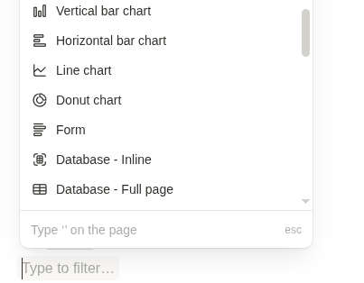
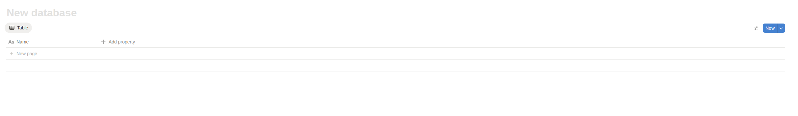
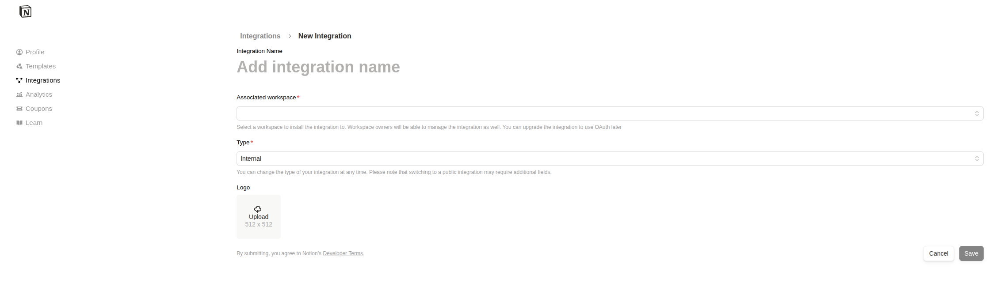
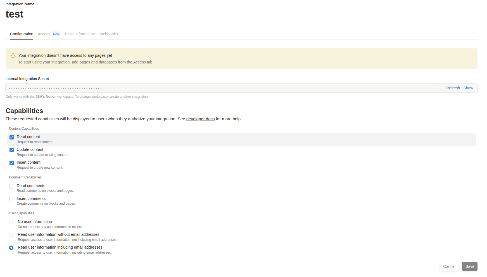
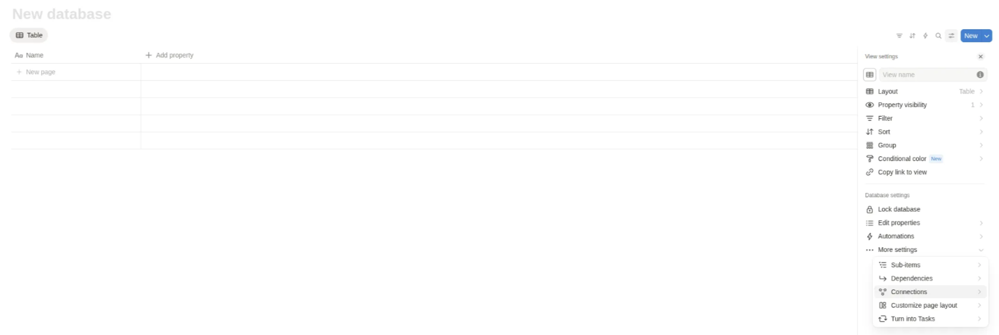
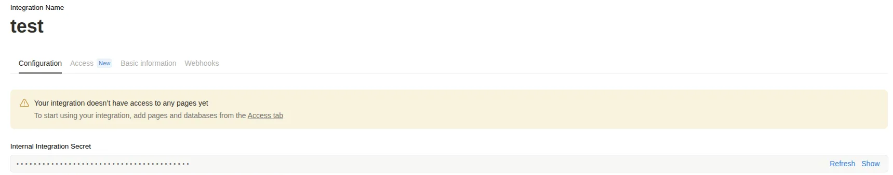
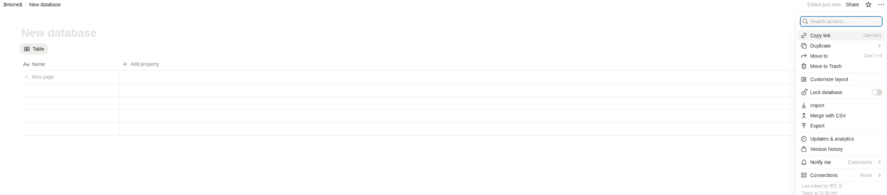
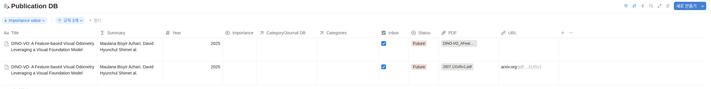

<p align="center">
  
</p>


# 📘 Notion Paper Manager

A tool for efficiently organizing research papers.  
It extracts metadata (title, authors, year, figures, tables, etc.) from **Arxiv** or **PDF files** and automatically uploads them to a Notion database. 

---

## <br>🌟 Features
- Extract metadata (title, authors, year) from **Arxiv ID** or **PDF file**  
- Use **[Docling](https://github.com/docling-project/docling)** to automatically extract figures and tables  
- Integrates with **Notion Database API** → creates paper entries and image blocks automatically  
- Helps researchers skim and organize papers more effectively  

---

## 

<br>

## Notion Database Setting

### 1. Create `Database`



Create block with `Database - Full page` 



<BR>

### 2. Set `Database Properties`

``` yaml
properties:
    title: "Title"
    year: "Year"
    url: "URL"
    rich_text: "Authors"
    checkbox: "Inbox"
    file: "PDF"
    select: "Status"
```

<BR>

### 3. Create an integration and connect it to your database.

[Create a Notion Integration](https://developers.notion.com/docs/create-a-notion-integration) 






- Connect `Integration` to your `Database`



<BR>

### 4. Get Notion Token and Database ID 

- get notion token



- get Database ID



The copied link looks like `https://www.notion.so/{your_database_id}?v=...`

<br>

## ⚙️ Installation

### 1. Clone the repository

```bash
git clone https://github.com/bottle-an00/Notion-Paper-Manager.git
cd Notion-Paper-Manager
```

### <br>2. Install dependencies
```bash
pip install -r requirements.txt
```

### <br>

### 3. Set enviornment variables 

Create a `.env` file in the project root directory

```env
NOTION_TOKEN=your_notion_api_key
NOTION_DATABASE_ID=your_database_id

WORKDIR_DATA=data
WORKDIR_OUTPUT=output
```

### <br>4. Run

- Register paper by Arxiv ID.

```bash
python main.py --arxiv-id <arxiv_id> --extract-figures --add-to-notion --device cuda
```

- Register paper by PDF file.

```bash
python main.py --pdf <your pdf dir> --extract-figures --add-to-notion --device cuda
```

- Running on CPU is possible, but it may take a long time.

```bash
pthon main.py --arxiv-id <arxiv_id> --extract-figures --add-to-notion --device cpu
```


## <br>😚 Result



<br>

## ✔️ TODO

- [ ] Extract mathematical formulas from PDFs
- [ ] Provide a simple GUI interface
- [ ] Uploading files > 5MB with Google Drive API
